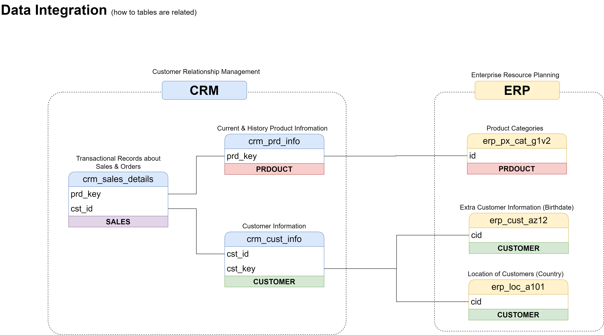

# Data Warehouse and Analytics Project

Welcome to the **Data Warehouse and Analytics Project** repository! 🚀  
This project demonstrates a comprehensive data warehousing and analytics solution, from building a data warehouse to generating actionable insights. Designed as a portfolio project, it highlights industry best practices in data engineering and analytics.

---

## 📖 Project Overview

This project involves:

1. **Data Architecture**: Designing a Modern Data Warehouse Using Medallion Architecture **Bronze**, **Silver**, and **Gold** layers.
2. **ETL Pipelines**: Extracting, transforming, and loading data from source systems into the warehouse.
3. **Data Modeling**: Developing fact and dimension tables optimized for analytical queries.
4. **Analytics & Reporting**: Creating SQL-based reports and dashboards for actionable insights.

---

## ⚒ ETL 

An ETL pipeline built using Medallion Architecture to efficiently ingest, transform, and store data across Bronze, Silver, and Gold layers. Ensures scalable, clean, and high-quality data processing for analytics and reporting.


## 🏗️ Data Architecture

The data architecture for this project follows Medallion Architecture **Bronze**, **Silver**, and **Gold** layers:


1. **Bronze Layer**: Stores raw data as-is from the source systems. Data is ingested from CSV Files into SQL Server Database.
2. **Silver Layer**: This layer includes data cleansing, standardization, and normalization processes to prepare data for analysis.
3. **Gold Layer**: Houses business-ready data modeled into a star schema required for reporting and analytics.

## 🖇 Data Flow


## 🏗️ Data Integration 




## 🎯 Data Model 


---


## 📂 Repository Structure
```
data-warehouse-project/
│
├── datasets/                           # Raw datasets used for the project (ERP and CRM data)
│
├── docs/                               # Project documentation and architecture details
│   ├── etl.drawio                      # Draw.io file shows all different techniquies and methods of ETL
│   ├── data_architecture.drawio        # Draw.io file shows the project's architecture
│   ├── data_catalog.md                 # Catalog of datasets, including field descriptions and metadata
│   ├── data_flow.drawio                # Draw.io file for the data flow diagram
│   ├── data_models.drawio              # Draw.io file for data models (star schema)
│   ├── naming-conventions.md           # Consistent naming guidelines for tables, columns, and files
│
├── scripts/                            # SQL scripts for ETL and transformations
│   ├── bronze/                         # Scripts for extracting and loading raw data
│   ├── silver/                         # Scripts for cleaning and transforming data
│   ├── gold/                           # Scripts for creating analytical models
│

